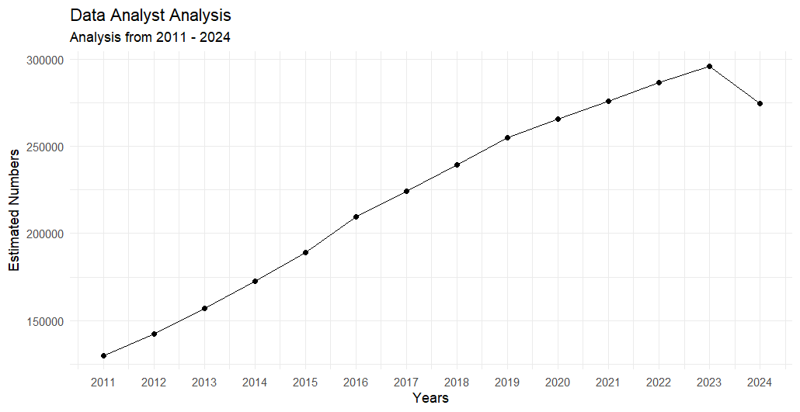
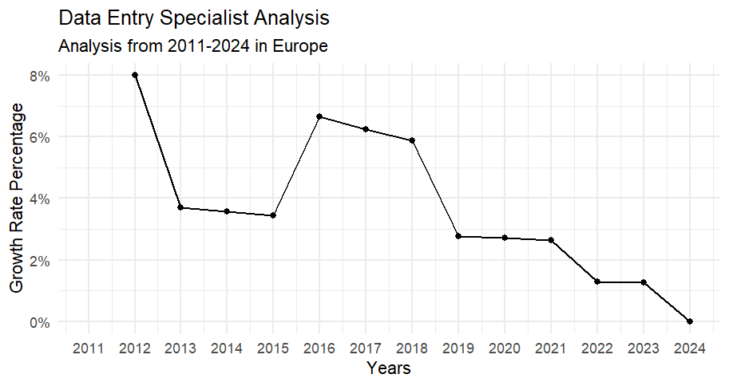
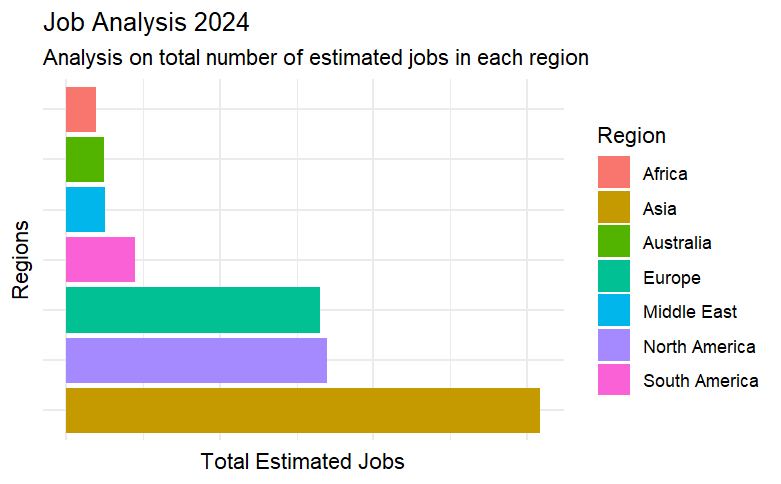
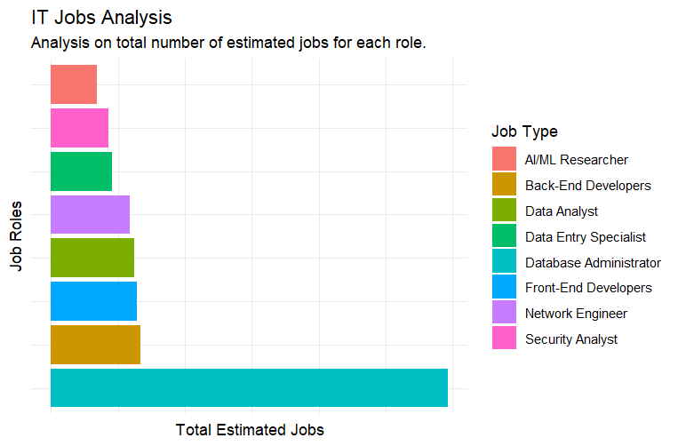

# IT Jobs Analysis 2011-2024

A project with estimated numbers to analyze IT jobs from 2011 to 2024.

Following job roles I included in my project:

-   Data Analyst

-   Front-End Developer

-   Back-End Developer

-   Data Entry Specialist

-   Network Engineer

-   Security Analyst

-   Database Administrator

-   AI/ML Researcher

**Note:** The estimated numbers in data set may not be a perfect numbers because I created this data set with the help of *Chatgpt* so there might be mistakes in numbers but that's a good project to consider as a beginner's level.

## Trend Analysis

In Trend Analysis, You need to research about two things,

-   Each Job Role Analysis

-   Region Wise Analysis

### Each Job Role Analysis

In each job role analysis, you need to analyze the changes in specific job according to years.

``` r
# creating new dataframe to get data for each job role according to years
job_df <- df %>%
  group_by(Year,`Job Type`) %>%
  summarise(Total=sum(`Estimated Number`))
# Filtering job types to include data only for data analyst
year_dataAnalyst <- job_df %>%
  filter(`Job Type`=="Data Analyst")
```

Now we have data for "Data Analyst", Let's create a Scatter plot with more clear representation of our result.

``` r
ggplot(data=year_dataAnalyst,aes(x=Year,y=Total)) +
  geom_line() + geom_point() +
  # adding breaks from 2011 to 2024 to include each year on x axis
  scale_x_continuous(breaks=seq(2011,2024,by=1)) +
  # Setting theme of own choice
  theme_minimal() +
  labs(title="Data Analyst Analysis",subtitle="Analysis from 2011 - 2024",x="Years",y="Estimated Numbers")
```



### Region-wise Analysis

Now analyze specific job role in each year region wise according to their growth rates that how patterns changed or in which region there is an increase or decrease

``` r
growth_rate_data <- df %>%
  group_by(Region,`Job Type`) %>%
  # used dplyr lag function to shift a time series or vector by a specified number , often to create lagged variables for time analysis or data manipulation
  mutate(Growth_Rate=(`Estimated Number`-lag(`Estimated Number`))/lag(`Estimated Number`))
```

Now, we have created our new column of Growth Rate. Let's crate a new dataframe object in which we filter by region and job type.

``` r
regions_wise_DES <- growth_rate_data %>%
  filter(Region=="Europe",`Job Type`=="Data Entry Specialist")
```

Let's create a scatter plot for better representation.

``` r
ggplot(data=regions_wise_DES,aes(x=Year,y=Growth_Rate))+ 
  geom_line() +
  geom_point() +
  scale_x_continuous(breaks=seq(2011,2024,by=1)) +
  theme_minimal() +
  # changing y axis labels to a percent using scales function
  scale_y_continuous(labels=scales::percent) +
  labs(title="Data Entry Specialist Analysis",subtitle="Analysis from 2011-2024 in Europe",x="Years",y="Growth Rate Percentage")
```



## Regional Distribution

Now, we need to do regional analysis that which region had the highest number of jobs.

Let's go for latest year in our dataset for analysis.

``` r
regional <- growth_rate_data %>%
  filter(Year==max(Year)) %>%
  group_by(Region) %>%
  summarise(Total=sum(`Estimated Number`))
```

Now we got the total number of jobs region wise in 2024.

Let's create a bar chart for more clear representation.

``` r
ggplot(data=regional,aes(x=reorder(Region,-Total),y=Total)) +
  geom_bar(stat="identity",aes(fill=Region)) +
  theme_minimal() +
  coord_flip() +
  theme(axis.text.x=element_blank()) + 
  theme(axis.text.y=element_blank()) +
  labs(title="Job Analysis 2024",subtitle="Analysis on total number of estimated jobs in each region",x="Regions",y="Total Estimated Jobs")
```



## Role Popularity

Now we will calculate which job role has a great popularity from 2011-2024

``` r
role_popular <- df %>%
  group_by(`Job Type`) %>%
  summarise(Total=sum(`Estimated Number`))
```

Now we will create a bar chart for clear representation of our result.

``` r
ggplot(data=role_popular,aes(x=reorder(`Job Type`,-Total),y=Total)) +
  geom_bar(stat="identity",aes(fill=`Job Type`)) +
  theme_minimal() +
  theme(axis.text.x=element_blank()) + 
  theme(axis.text.y=element_blank()) + 
  coord_flip() +
  labs(title="IT Jobs Analysis",subtitle="Analysis on total number of estimated jobs for each role.",x="Job Roles",y="Total Estimated Jobs")
```



## Yearly Comparison

Now we will do a yearly comparison that which year there are more and more IT jobs.

``` r
yearly_comparison <- growth_rate_data %>%
  group_by(Year) %>%
  summarise(Total=sum(`Estimated Number`))
```

Now let's create a bar chart for more clear representation.

``` r
ggplot(data=yearly_comparison,aes(x=reorder(Year,Total),y=Total)) +
  geom_bar(stat="identity",fill="lightgreen") +
  theme_minimal() +
  coord_flip() +
  theme(axis.text.x=element_blank()) +
  labs(title="IT Jobs Analysis",subtitle="Yearly comparison of Jobs 2011-2024",x="Years",y="Total IT Jobs")
```


